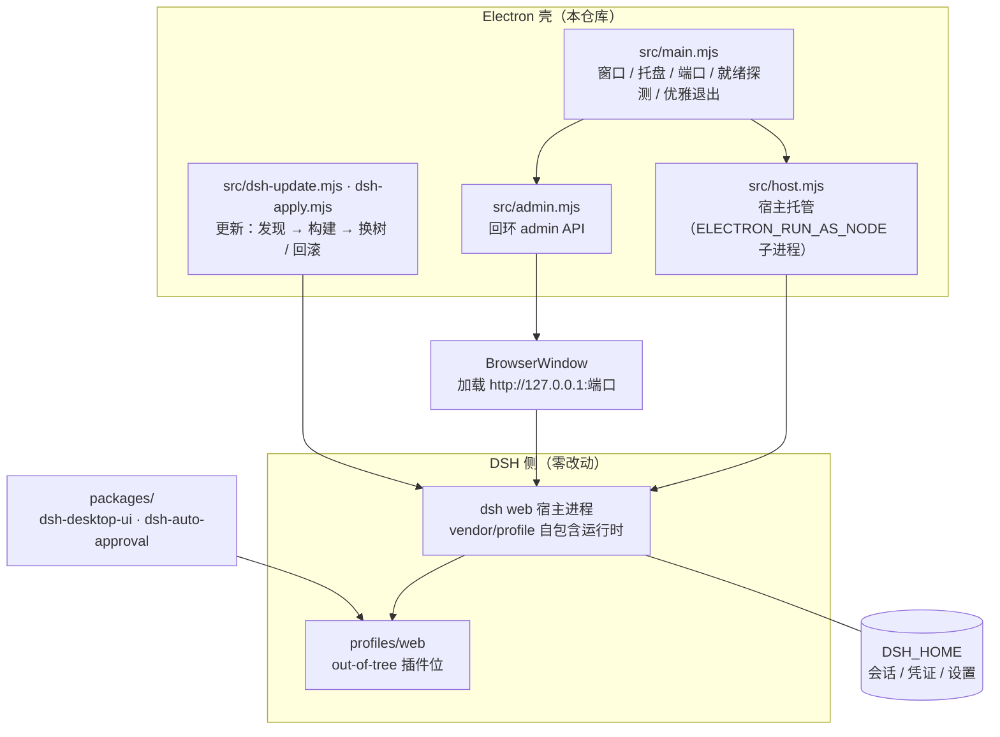

[](https://www.electronjs.org/)
[](#快速开始)
[](https://github.com/cdbge/dshdt/releases)
[](desktop-electron/vendor/vendor.lock.json)
[](LICENSE)

<div align="center">


# dshdt · DSH 桌面版

_把 DeepSeek Harness 的 Web 界面装进桌面应用：托盘常驻、多窗口复用、壁纸皮肤、一键更新。_

</div>

## 项目简介
**dshdt** 是 **DeepSeek Harness**（下称 **DSH**）的 **Electron 桌面壳**：DSH 只提供 Web 界面，dshdt 托管它的宿主
进程，用一个独立窗口 + 托盘把它变成"装好就能用"的桌面软件。它**不是** DSH 的分支或魔改版：**DSH 本体零改动**，
壳侧能力全部走 `--port` / `--patch` / 回环 admin API / 环境变量 / 浏览器 CSS 注入这几条既有通道。

### 它解决什么问题
| 原生 DSH（Web） | 换成 dshdt 之后 |
|---|---|
| 每次手动开终端、敲命令起服务 | 双击图标即用，**托盘常驻**，退出自动停宿主 |
| 端口/进程自己管，忘了关就残留 | 自动找空闲端口、同 home 只起一个宿主、**优雅退出** |
| 浏览器标签页，容易误关 | 独立窗口 + 托盘唤起，多窗口自动复用同一个宿主 |
| 界面是纯白/纯黑，看久了累 | **壁纸、遮罩、亮度、模糊**可调，侧栏与对话区分档 |
| 升级 harness 要手抄步骤 | 内置**更新按钮**：发现 → 构建 → 换树，带启动门禁与回滚 |
| 权限申请要一个个点"允许" | 自带审批插件，**由模型裁决**并留下审计日志 |
| 崩了只看到一句"启动失败" | `--diag` 一键取证 + **宿主最后遗言**进通知 |

### 它不是什么
- **Windows 与 Linux 已实测并出包**（Linux 为 AppImage/deb）；macOS 有构建链路但未在真机验证。
- **不含任何密钥**：模型凭证由 DSH 自己管理，壳不读不写。
- 不是 DSH 的替代品：没有 DSH 凭证时，它只是一个"起不来的壳"。

## 核心功能
- **宿主托管**：以 `ELECTRON_RUN_AS_NODE` 子进程方式托管 `dsh web`，自动选端口、探测就绪、退出时停干净。
- **多窗口复用**：靠 `DSH_HOME/.dsh-host.lock` + 端口探测（`ss`/`lsof`）找宿主，同 home 只起一个，加开窗口不重复起服务。
- **桌面化外观**：壁纸（含**亮度 / 模糊**滑块）、对话区与侧栏**遮罩分档**、全屏态独立档位、透明滚动条、按钮 hover/active 交互。
- **DSH 更新按钮**：版本发现 → vendor 树构建 → **换树与回滚**；跨版本拒绝，需显式放行。
- **一键热更新 dshdt 自己**：设置 → 桌面的「仓库功能更新」从 GitHub 仓库拉**缺的/变了的文件**（自带插件、宿主补丁层、市场目录），再点「**换壳并重启**」把壳源码换进 `app.asar`；替换由独立助手进程在应用退出后完成，**换完先用 `--smoke` 校验新壳，不过自动回滚**；安装目录只读时（Linux deb / AppImage）如实拒绝。
- **权限审批插件**：审批瀑布上抢在弹窗之前，**一次独立模型调用**裁决（fail-closed，可 `/approval` 开关），决策写审计日志。
- **崩溃可诊断**：宿主 stdio 两级化（管道优先 + 环形缓冲，保留**最后遗言**）、`--diag` 一键取证、启动前 preflight、`--doctor` 体检。
- **会话日志自愈**：半个 zstd 尾帧截断、首帧异常逐行重编码；修不动的隔离改名而不是删。
- **profile 补丁层自愈**：每次启动修复被写坏的 `cordis.patch.yml`。
- **只绑回环**：admin API 只监听 `127.0.0.1`，CORS 白名单，本地文件一律走受控 HTTP 供给。

## 快速开始

### 方式一：直接下载安装（推荐）
1. 打开 **[Releases](https://github.com/cdbge/dshdt/releases)**，下载最新的 `DSHDesktop-Setup-*.exe`（127.4 MB）。
2. 双击安装（安装程序**拒绝覆盖正在运行的实例**，装之前先退出 dshdt）。
3. 从开始菜单或桌面图标启动 → 托盘出现图标 → 窗口自动打开。

> **未签名**：本包未做代码签名，首次运行 Windows SmartScreen 会拦一次，点「更多信息 → 仍要运行」即可。
> **校验**：`SHA256 = 481009BD5710C5258A53EE5B5EDBEA78AF3FA804E3AE3F9A1A3D0EF04EF3F505`

**系统要求**：Windows 10 / 11 或 Linux（均为 64 位）。**DSH 运行时已随包自带**（`vendor/profile`，版本 `0.1.6-alpha.1`），无需另装 DSH。

### 方式二：从源码运行（开发者）
| 依赖 | 版本 | 说明 |
|---|---|---|
| Windows | 10 / 11 x64 | 目前只在 Windows 实测 |
| Node.js | 22 或更高 | CI 使用 22；24 亦可 |
| npm | 随 Node 安装 | 构建 vendor 与检查更新时需要访问 npm registry（默认 `registry.npmmirror.com`，见 `src/dsh-update.mjs` 的 `DEFAULT_REGISTRY`） |
| 磁盘 | ≥ 2 GB | `node_modules` + 自包含运行时 |

```powershell
git clone https://github.com/cdbge/dshdt.git
cd dshdt/desktop-electron
npm install                 # 安装壳的依赖
npm run build:host          # 构建自包含 DSH 运行时（install → 剪枝 → 插件同步 → ABI 门禁）
npm start                   # 启动；npm run dev 保留 DevTools
```
验证安装是否正常：

```powershell
npx electron . --doctor     # 环境体检（路径 / 环境变量 / preflight / 依赖完整性）
npx electron . --diag       # 一键取证：路径、环境变量、宿主锁、依赖文件数、三份日志尾部
npm run smoke               # 端到端全量冒烟（72 断言，需完整权限）
```
> **被托管的环境里跑 electron 之前**先 `Remove-Item Env:ELECTRON_RUN_AS_NODE` —— 它会让 `electron.exe` 退化成
> 纯 Node，症状是"无窗口、无日志"。

## 使用说明
- **托盘菜单**：显示/隐藏窗口、**重启宿主（重载插件）**、打开设置、退出。
- **设置面板 →「桌面」分区**：背景图 / 遮罩强度 / 亮度 / 模糊 / 侧栏背景模式，改完**立即生效**。
- **DSH 更新按钮**：检查 → 下载构建 → 应用换树；换树前有启动门禁，失败会回滚。
- **「仓库功能更新」**：`检查` 只联网比对（不落盘），`更新` 把仓库里缺的/变了的**功能文件**补到本地（自带插件、补丁层、市场目录）；仓库里的**壳源码**也变了才会多出 `换壳并重启` 按钮——点它退出应用，由助手进程替换 `app.asar` 并**先用 `--smoke` 校验新壳**（约 1 分钟），通过则重启、不通过回滚；只读安装形态（deb / AppImage）不支持换壳。
- **端口每次启动都可能变**：真实端口在 `$DSH_HOME\.dsh-host.lock` 或壳日志里，`/api/status` 也能读到。
- **不同改动的生效方式不同**：客户端插件改完 `POST /api/reload-window` 刷新即见；服务端插件（审批）**必须重启宿主**（托盘里那一项）；改 `src/*.mjs` 要重打 asar + 重启应用。

## 自带插件
两个插件都落在 DSH 的 **out-of-tree 插件位**（`profiles/web/node_modules/<包名>`），不打补丁进 DSH 源码：

| 插件 | 侧 | 作用 |
|---|---|---|
| `dsh-desktop-ui` | 客户端 | 设置面板新增「桌面」分区；注入按钮交互样式 |
| `dsh-auto-approval` | 服务端 | 审批瀑布上**抢在用户弹窗之前**裁决权限申请：关键词表只作证据，裁决权交给一次独立模型调用；`/approval` 开关；日志 `$DSH_HOME\logs\auto-approval.log` |

> **自动放行的前提**：请求本身要有界。当前会话是 `workspace-write` 时，唯一能升的目标是 `danger-full-access`，
> 审查者**必然判 ask**；想看自动放行，把会话预设切成「仅可查看」。

## 架构设计

**模式 B**：壳不自己实现 UI，而是把 `electron.exe` 当 Node 用（`ELECTRON_RUN_AS_NODE` + `--expose-internals`）起
`dsh web` 宿主，再用 `BrowserWindow` 加载回环地址 —— 界面始终是 DSH 自己的界面，壳只负责把它管好。

## 项目结构
```
dshdt/
├─ desktop-electron/              # Electron 壳（主路线）
│  ├─ src/                        #   壳能力：main / host / admin / dsh-update(S1) / vendor-build(S2) / dsh-apply(S3) / platform-paths / repair / bg-css / skin-settings
│  ├─ packages/                   #   自带插件（桌面 UI / 权限审批 / 市场）
│  ├─ scripts/                    #   构建与门禁（smoke + 30 套离线自检）
│  ├─ build/icon.ico              #   图标（由根目录 dsh.jpeg 生成）
│  └─ vendor/vendor.lock.json     #   锁定的 DSH 版本与文件数基线
├─ .github/workflows/release.yml  # CI：三平台自检 + 打包 + 发布
├─ img/standby.jpeg               # 吉祥物（README 头图）
├─ dsh.jpeg                       # 应用图标源图「肥鱼」
└─ LICENSE / README.md / .gitattributes / .gitignore
```

## 构建与发布
```powershell
cd desktop-electron
npm run build:host      # 重建 vendor/profile（依赖版本变了才需要）
npm run dist            # electron-builder 打 NSIS 安装包（产物在 dist/，不入库）
```
- **产物不进仓库**：`dist/` 已被 `.gitignore` 覆盖，安装包只作为 **GitHub Release 附件**分发。
- **CI**：`.github/workflows/release.yml` 在推 `v*` tag 时构建 + 跑门禁 + 打包；签名证书放 Secrets（`WINDOWS_CERT_PFX` / `WINDOWS_CERT_PASSWORD`），未配置则出未签名包。
- **门禁基线**：**30 套离线自检 + `smoke` 72 断言**，改动后必须全绿（权威数字由 `npm run test:suite` 打印）。

## 常见问题
| 问题 | 处置 |
|---|---|
| 装完打不开，弹「DSH 宿主意外退出 exit code=1」 | 先分两类：① **留着旧数据的机器**——读 `%LOCALAPPDATA%\DSHDesktop\logs\host.log`，再对 `%USERPROFILE%\.dsh` 与 `%LOCALAPPDATA%\DSHDesktop\dsh-home` **改名（不是删）**后重启；**别卸载重装**（卸载程序不碰这两个目录）。② **全新环境**——查杀软/组策略拦截、`%USERPROFILE%` 含中文、全局 `NODE_OPTIONS` / `DSH_BIN`、解压不完整、Windows N/KN 版缺 Media Feature Pack。完整判据表见 [`desktop-electron/README.md`](desktop-electron/README.md) |
| 点了图标没反应，也没有日志 | 打包态未捕获异常会造成"进程不死、无窗口、无日志"。最早导入的 `early-errors.mjs` 负责落盘，日志在 `%LOCALAPPDATA%\DSHDesktop\logs\`；先跑 `DSH Desktop.exe --diag` 一次性打出路径、环境变量、依赖文件数与三份日志尾部 |
| 改了设置没生效 / 换了插件没反应 | 同一文件常有多份副本（打包内、安装目录、用户 profile）：客户端插件改完 `POST /api/reload-window`；服务端插件必须**重启宿主**；`src/*.mjs` 属壳代码，要重打 asar + 重启应用 |
| 为什么安装包这么大（127 MB） | 包里带着**自包含的 DSH 运行时**（`vendor/profile`，240 个包），为的是"装完即用、无需另装 DSH"；安装耗时主要跟**文件数**有关（解压 + Defender 逐文件扫描），所以按文件数剪枝优先于字节数 |
| 为什么自动审批没有自动放行 | 见上文「自带插件」：**请求本身要有界**才可能被放行。当前会话是 `workspace-write` 时，唯一能升的目标是 `danger-full-access`，审查者必然判 ask —— 这是正确行为 |

## 文档
| 文书 | 内容 |
|---|---|
| [`desktop-electron/README.md`](desktop-electron/README.md) | 代码侧说明：目录结构、构建流程、排障（含"别人机器起不来"的两类判据表） |

## Star
如果 dshdt 有用，欢迎 Star、提 Issue 或 PR；遇到问题先看 [`desktop-electron/README.md`](desktop-electron/README.md) 的排障章节与本页常见问题。

## 许可
[MIT](LICENSE) · 图标与吉祥物「肥鱼」为项目所有者自用形象（`dsh.jpeg` → `scripts/gen-icon.mjs` → `build/icon.ico`）。
