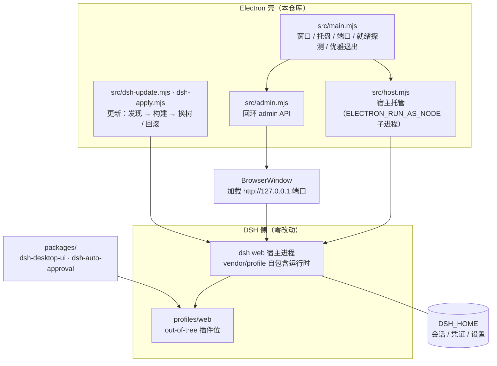

[](https://www.electronjs.org/)
[](#-快速开始)
[](https://github.com/cdbge/dshdt/releases)
[](desktop-electron/vendor/vendor.lock.json)
[](LICENSE)

<div align="center">

# dshdt · DSH 桌面版

_把 DeepSeek Harness 的 Web 界面装进一个真正的桌面应用 —— 托盘常驻、多窗口复用、壁纸皮肤、一键更新。_

> 工欲善其事，必先利其器。


</div>

---

## 📖 项目简介

**dshdt** 是 **DeepSeek Harness**（下称 **DSH**）的 **Electron 桌面壳**：
DSH 自己只提供 Web 界面，dshdt 把它的宿主进程托管起来，用一个独立窗口 + 托盘，把它变成"装好就能用"的桌面软件。

它**不是** DSH 的分支或魔改版：**DSH 本体零改动**，壳侧的一切能力都走 `--port` / `--patch` /
回环 admin API / 环境变量 / 浏览器 CSS 注入这几条既有通道。

### 它解决什么问题

| 原生 DSH（Web） | 换成 dshdt 之后 |
|---|---|
| 每次手动开终端、敲命令起服务 | 双击图标即用，**托盘常驻**，退出自动停宿主 |
| 端口/进程自己管，忘了关就残留 | 自动找空闲端口、同 home 只起一个宿主、**优雅退出** |
| 浏览器标签页，容易误关 | 独立窗口 + 托盘唤起，多窗口自动复用同一个宿主 |
| 界面是纯白/纯黑，看久了累 | **壁纸、遮罩、亮度、模糊**可调，侧栏与对话区分档 |
| 升级 harness 要手抄步骤 | 内置**更新按钮**：发现 → 构建 → 换树，带启动门禁与回滚 |
| 权限申请要一个个点"允许" | 自带审批插件，**由模型裁决**并留下审计日志 |
| 崩了只看到一句"启动失败" | `--diag` 一键取证 + **宿主最后遗言**进通知 |

### 它不是什么

- 不是跨平台成品：**目前在 Windows 上实测与打包**，macOS / Linux 未验证。
- **不含任何密钥**：模型凭证由 DSH 自己管理，壳不读不写，仓库里也永远不会有。
- 不是 DSH 的替代品：没有 DSH 凭证时，它只是一个"起不来的壳"。

## ✨ 核心功能

- **🖥️ 宿主托管**：以 `ELECTRON_RUN_AS_NODE` 子进程方式托管 `dsh web`，自动选端口、探测就绪、退出时停干净。
- **🪟 多窗口复用**：靠 `DSH_HOME/.dsh-host.lock` + `netstat` 找端口，同 home 只起一个宿主，**加开窗口不会重复起服务**。
- **🎨 桌面化外观**：壁纸（含**亮度 / 模糊**滑块）、对话区与侧栏**遮罩分档**、全屏态独立档位、透明滚动条、按钮 hover/active 交互。
- **🔄 DSH 更新按钮**：版本发现 → vendor 树构建 → **换树与回滚**；跨版本升级默认拒绝，需显式放行。
- **🔐 权限审批插件**：审批瀑布上抢在弹窗之前，**一次独立模型调用**裁决（fail-closed，可 `/approval` 开关），决策写审计日志。
- **🩺 崩溃可诊断**：宿主 stdio 两级化（管道优先 + 环形缓冲，保留"**最后遗言**"）、`--diag` 一键取证、启动前 preflight、`--doctor` 体检。
- **🧹 会话日志自愈**：半个 zstd 尾帧截断、首帧异常逐行重编码；修不动的隔离改名而不是删。
- **🛡️ profile 补丁层自愈**：每次启动修复被写坏的 `cordis.patch.yml`（这个曾让一批机器"装完打不开"）。
- **🔒 只绑回环**：admin API 只监听 `127.0.0.1`，CORS 白名单，本地文件一律走受控 HTTP 供给。

## 🚀 快速开始

### 🎁 方式一：直接下载安装（推荐）

1. 打开 **[Releases · v0.4.6](https://github.com/cdbge/dshdt/releases/tag/v0.4.6)**，下载 `DSHDesktop-Setup-0.4.6.exe`（127.4 MB）。
2. 双击安装（安装程序**拒绝覆盖正在运行的实例**，装之前先退出 dshdt）。
3. 从开始菜单或桌面图标启动 → 托盘出现图标 → 窗口自动打开。

> **⚠️ 未签名说明**：本包**未做代码签名**，首次运行 Windows SmartScreen 会拦一次，
> 点「更多信息 → 仍要运行」即可。这是没有证书环境下的预期结果，**不是包损坏**。
>
> **校验**：`SHA256 = 481009BD5710C5258A53EE5B5EDBEA78AF3FA804E3AE3F9A1A3D0EF04EF3F505`

**系统要求**：Windows 10 / 11（64 位）。**DSH 运行时已随包自带**（`vendor/profile`，版本 `0.1.5-rc.2`），无需另外安装 DSH。

### 🛠️ 方式二：从源码运行（开发者）

**前置条件**

| 依赖 | 版本 | 说明 |
|---|---|---|
| Windows | 10 / 11 x64 | 目前只在 Windows 实测 |
| Node.js | 22 或更高 | CI 使用 22；24 亦可 |
| npm | 随 Node 安装 | 构建 vendor 与检查更新时需要能访问 npm registry（默认 `registry.npmmirror.com`，见 `src/dsh-update.mjs` 的 `DEFAULT_REGISTRY`） |
| 磁盘 | ≥ 2 GB | `node_modules` + 自包含运行时 |

**步骤**

```powershell
# 1) 克隆
git clone https://github.com/cdbge/dshdt.git
cd dshdt/desktop-electron

# 2) 安装壳的依赖
npm install

# 3) 构建自包含 DSH 运行时（install → 剪枝 → 插件同步 → ABI 门禁）
npm run build:host

# 4) 启动
npm start          # npm run dev 保留 DevTools
```

**验证安装是否正常**

```powershell
npx electron . --doctor     # 环境体检（路径 / 环境变量 / preflight / 依赖完整性）
npx electron . --diag       # 一键取证：路径、环境变量、宿主锁、依赖文件数、三份日志尾部
npm run smoke               # 端到端全量冒烟（72 断言，需完整权限）
```

> **⚠️ 在被托管的环境里跑 electron 之前**，先 `Remove-Item Env:ELECTRON_RUN_AS_NODE` ——
> 这个变量会让 `electron.exe` 退化成纯 Node，症状是"无窗口、无日志"。

## ⚙️ 使用说明

- **托盘菜单**：显示/隐藏窗口、**重启宿主（重载插件）**、打开设置、退出。
- **设置面板 →「桌面」分区**：背景图 / 遮罩强度 / 亮度 / 模糊 / 侧栏背景模式。改完**立即生效**，不用重启。
- **DSH 更新按钮**：检查 → 下载构建 → 应用换树；换树前有启动门禁，失败会回滚。
- **端口每次启动都可能变**：真实端口在 `$DSH_HOME\.dsh-host.lock` 或壳日志里，`/api/status` 也能读到。
- **不同改动的生效方式不同**：客户端插件改完 `POST /api/reload-window` 刷新即见；
  服务端插件（审批）**必须重启宿主**（托盘里那一项）；改 `src/*.mjs` 要重打 asar + 重启应用。

## 🔌 自带插件

两个插件都落在 DSH 的 **out-of-tree 插件位**（`profiles/web/node_modules/<包名>`），不打补丁进 DSH 源码：

| 插件 | 侧 | 作用 |
|---|---|---|
| `dsh-desktop-ui` | 客户端 | 设置面板新增「桌面」分区；注入按钮交互样式 |
| `dsh-auto-approval` | 服务端 | 审批瀑布上**抢在用户弹窗之前**裁决权限申请：关键词表只作证据，裁决权交给一次独立模型调用；`/approval` 开关；日志 `$DSH_HOME\logs\auto-approval.log` |

> **自动放行的前提**：请求本身要有界。当前会话是 `workspace-write` 时，唯一能升的目标是
> `danger-full-access`，称职的审查者**必然判 ask** —— 想看自动放行，把会话预设切成「仅可查看」。

## 🏗️ 架构设计



**模式 B**：壳不自己实现 UI，而是把 `electron.exe` 当 Node 用（`ELECTRON_RUN_AS_NODE` + `--expose-internals`）
起 `dsh web` 宿主，再用 `BrowserWindow` 加载回环地址 —— 界面始终是 DSH 自己的界面，壳只负责"把它管好"。

## 🗂️ 项目结构

```
dshdt/
├─ desktop-electron/              # 当前主路线：Electron 壳
│  ├─ src/                        #   主进程与壳能力
│  │  ├─ main.mjs                 #     窗口 / 托盘 / 端口 / 背景图注入 / admin 装配
│  │  ├─ host.mjs                 #     宿主托管（findDshBin / freePort / waitReady / killTree）
│  │  ├─ admin.mjs                #     回环 admin HTTP（/api/* + /bg-image）
│  │  ├─ dsh-update.mjs           #     S1 版本发现
│  │  ├─ vendor-build.mjs         #     S2 vendor 树构建原语（install / 剪枝 / ABI 门禁）
│  │  ├─ dsh-apply.mjs            #     S3 换树与回滚（唯一不可逆操作，全分支有单测）
│  │  ├─ junction-safe.mjs        #     含链接目录的安全删除
│  │  ├─ repair.mjs               #     会话日志自愈
│  │  └─ early-errors.mjs         #     打包态未捕获异常落盘（必须最先导入）
│  ├─ packages/                   #   自带插件（客户端 UI + 权限审批）
│  ├─ scripts/                    #   构建与门禁（smoke + 9 套离线自检）
│  ├─ build/icon.ico              #   图标（由根目录 dsh.jpeg 生成）
│  └─ vendor/vendor.lock.json     #   锁定的 DSH 版本与文件数基线
├─ docs/通用/                     # 通用规范（可整目录拷进任何新项目）
├─ docs/项目/                     # 本项目：架构 / 坑清单 / 范例 / 计划
├─ img/standby.jpeg               # 吉祥物（README 头图）
├─ dsh.jpeg                       # 应用图标源图「肥鱼」
└─ LICENSE / README.md / .gitattributes / .gitignore
```

## 🔧 构建与发布

```powershell
cd desktop-electron
npm run build:host      # 重建 vendor/profile（依赖版本变了才需要）
npm run dist            # electron-builder 打 NSIS 安装包（产物在 dist/，**不入库**）
```

- **产物不进仓库**：`dist/` 已被 `.gitignore` 覆盖，安装包只作为 **GitHub Release 附件**分发（Git 历史会永久保留二进制）。
- **CI**：`.github/workflows/release.yml` 在推 `v*` tag 时构建 + 跑门禁 + 打包；签名证书放 Secrets
  （`WINDOWS_CERT_PFX` / `WINDOWS_CERT_PASSWORD`），未配置则出未签名包。
- **开发过程中踩过的坑**：构建/发布/宿主链路上踩过的环境与工具问题（含若干"看起来像断网、像崩溃"的），
  统一记在 [`docs/项目/03-坑清单.md`](docs/项目/03-坑清单.md)（坑 1~63，按现象/根因/修法/验证/通用教训写），README 不重复。
- **门禁基线**：9 套离线自检合计 **242 断言** + `smoke` **72 断言**；改动后必须全绿才算完成。

## ❓ 常见问题

<details>
<summary><b>装完打不开，弹「DSH 宿主意外退出 exit code=1」</b></summary>

**先分两类**，处置完全不同：

1. **留着旧数据的机器**（装过早期版本，或恢复出厂但保留了用户目录）——
   先读 `%LOCALAPPDATA%\DSHDesktop\logs\host.log`，再对 `%USERPROFILE%\.dsh` 与
   `%LOCALAPPDATA%\DSHDesktop\dsh-home` **改名（不是删）**后重启应用。
   **别卸载重装**：卸载程序不碰这两个目录，重装永远修不好。
2. **全新环境**（重装过系统 / 新机器）——旧数据理论不成立，改查"环境是否允许它跑"：
   杀软与组策略拦截、`%USERPROFILE%` 含中文、全局 `NODE_OPTIONS` / `DSH_BIN`、
   解压不完整、Windows N/KN 版缺 Media Feature Pack。

两张完整判据表见 [`desktop-electron/README.md`](desktop-electron/README.md)。
</details>

<details>
<summary><b>点了图标没反应，也没有日志</b></summary>

打包态的未捕获异常会造成"进程不死、无窗口、无日志"。本仓库第一个导入的就是
`early-errors.mjs`（负责落盘），日志在 `%LOCALAPPDATA%\DSHDesktop\logs\`。
先跑 `DSH Desktop.exe --diag`，把路径、环境变量、依赖文件数、三份日志尾部一次性打出来。
</details>

<details>
<summary><b>改了设置没生效 / 换了插件没反应</b></summary>

同一个文件常常有**多份副本**：打包内、安装目录、用户 profile。客户端插件改完要
`POST /api/reload-window`；服务端插件必须**重启宿主**；`src/*.mjs` 属于壳代码，要重打 asar + 重启应用。
</details>

<details>
<summary><b>为什么安装包这么大（127 MB）？</b></summary>

包里带着一份**自包含的 DSH 运行时**（`vendor/profile`，240 个包），为的是"装完即用、无需另装 DSH"。
安装耗时主要跟**文件数**有关（解压 + Defender 逐文件扫描），所以构建时按文件数剪枝优先于字节数。
</details>

<details>
<summary><b>为什么自动审批没有自动放行？</b></summary>

见上文「自带插件」：**请求本身要有界**才可能被放行。当前会话是 `workspace-write` 时，
唯一能升的目标是 `danger-full-access`，审查者必然判 ask —— 这是正确行为，不是 bug。
</details>

## 📄 文档导航

| 文书 | 内容 |
|---|---|
| **[`docs/通用/`](docs/通用/)** | **与项目无关的通用规范，可整目录拷进任何新项目** |
| ├ [`01-代码规范.md`](docs/通用/01-代码规范.md) | 命名、目录、风格、错误处理、状态可逆、配置与密钥、日志、依赖、安全 |
| ├ [`02-提交与门禁.md`](docs/通用/02-提交与门禁.md) | 提交信息规范、门禁分层、检查点协议、发布纪律、公开仓库前体检清单 |
| ├ [`03-AI协作与文档义务.md`](docs/通用/03-AI协作与文档义务.md) | 单一事实源、开工清单模板、交接便条模板、文档同步矩阵、AI 协作铁律 |
| └ [`04-排障方法与通用坑.md`](docs/通用/04-排障方法与通用坑.md) | 六步排障法、Windows/Node/文件系统/Electron 通用坑、验证技法、判据表 |
| **[`docs/项目/`](docs/项目/)** | **本项目专属** |
| ├ [`00-文档导航.md`](docs/项目/00-文档导航.md) | 入口与旧→新文书对照表 |
| ├ [`01-新会话开工清单.md`](docs/项目/01-新会话开工清单.md) | 状态锚点、交接便条、下一步、挂起事项（接手先读） |
| ├ [`02-架构与铁律.md`](docs/项目/02-架构与铁律.md) | 项目铁律、工程地图、DSH 侧规则、命名落点 |
| ├ [`03-坑清单.md`](docs/项目/03-坑清单.md) | **坑 1~63**：现象 / 根因 / 修法 / 验证 / 通用教训 |
| ├ [`04-范例与检查点.md`](docs/项目/04-范例与检查点.md) | 端到端代码范例、检查点命令清单、提交规范 |
| └ [`计划/`](docs/项目/计划/) | 四份计划与进度文书（`Electron施工计划与进度.md` 是**唯一进度事实源**） |
| [`desktop-electron/README.md`](desktop-electron/README.md) | 代码侧说明：结构、构建、排障（含"别人机器起不来"的两类判据表） |
| [`desktop-electron/CHANGELOG.md`](desktop-electron/CHANGELOG.md) | 按版本倒序的变更与事故复盘 |

## ⭐ Star

如果 dshdt 让你少敲了几次命令、少看了几眼白屏，欢迎点个 **Star** —— 这是最直接的支持。

也欢迎 **Fork** 出自己的分支、提 **Issue** 报告问题或建议、提 **PR** 一起改进。
遇到问题请先翻一遍 [`docs/项目/03-坑清单.md`](docs/项目/03-坑清单.md)：几十条实战坑，很可能已经写过。

<div align="center">

**💝 感谢关注与支持！**

</div>

## 许可

[MIT](LICENSE) · 图标与吉祥物「肥鱼」为项目所有者自用形象（`dsh.jpeg` → `scripts/gen-icon.mjs` → `build/icon.ico`）。
