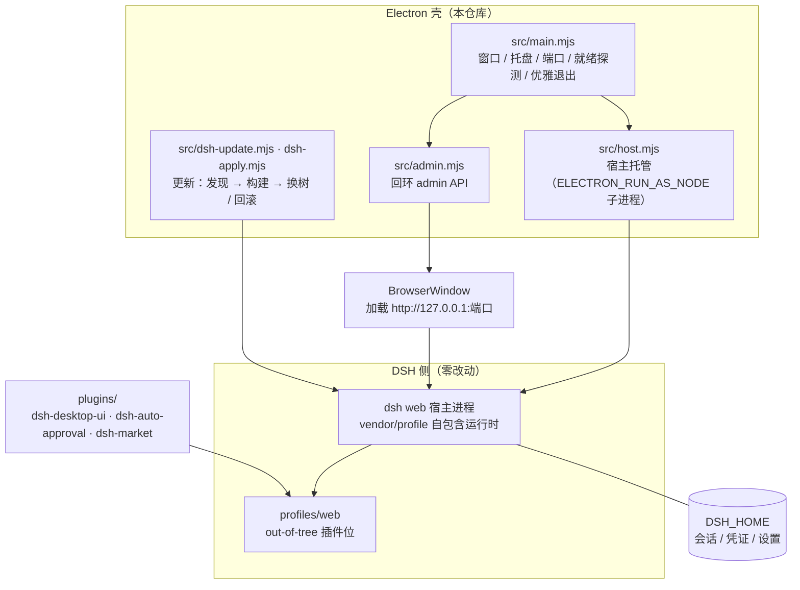

[](#停止更新公告)
[](https://www.deepseek.com/download/)
[](LICENSE)

<div align="center">


# dshdt · DSH 桌面版

_本仓库已停止更新。桌面端请改用官方版本 → <https://www.deepseek.com/download/>_

</div>

## 停止更新公告

**dshdt 已停止更新**：不再发布新版本、不再合并 PR、不再处理 Issue。仓库保留为存档，壳源码与自研插件原样可读可用。

停更的原因是它的存在前提消失了：**官方已经发布 DeepSeek Harness 桌面端**（`@deepseek-ai/dsh-desktop`，当前 `0.2.0-rc.2`）。托盘常驻、多窗口复用、自包含运行时、插件管理这些当初要由本壳补齐的能力，官方端已经自带。

### 去哪儿：官方桌面端

| 平台 | 下载 |
|---|---|
| Windows 10 / 11 x64 | <https://download.deepseek.com/desktop/dsh-latest-windows-x64.exe> |
| macOS 13+（Apple 芯片） | <https://download.deepseek.com/desktop/dsh-latest-macos-arm64.dmg> |
| 下载页（版本与说明以它为准） | <https://www.deepseek.com/download/> |

### 已经装了 dshdt 的机器怎么切过去

1. **装官方桌面端，先退出 dshdt**（别让两个壳同时托管同一个 `$DSH_HOME`）。
2. **会话不用搬**：两者托管的是同一套 DSH 运行时、同一个 home（区别只在 profile，见下条）—— home 解析顺序是「显式 `DSH_HOME` > 已存在的 `%USERPROFILE%\.dsh` > `%LOCALAPPDATA%\DSHDesktop\dsh-home`」。只要机器上有 `%USERPROFILE%\.dsh`（官方端也用它），历史会话、凭证、设置用官方端打开就是原样。
   - 例外：当初 dshdt 落在 `%LOCALAPPDATA%\DSHDesktop\dsh-home` 的话，把那里的 `sessions\`、`.credentials.yaml`、`settings.yaml` 拷进 `%USERPROFILE%\.dsh` 即可。
3. **插件不用搬，但要看 profile**：两个壳用的是**不同的 profile**，互不干扰 ——

   | 宿主 | profile | 插件位（Windows） |
   |---|---|---|
   | dshdt 壳 | `web` | `%USERPROFILE%\.dsh\profiles\web\node_modules\` |
   | 官方桌面端 | `desktop` | `%USERPROFILE%\.dsh\profiles\desktop\node_modules\`（本机实测：官方装的 `dsh-plugin-wallpaper-engine` 就在这里；官方端把宿主起在 `profiles\desktop`，端口 19387） |

   所以 dshdt 装在 `web` 里的三个插件，官方端**不会加载**，不删也不干扰它。想让官方端也用上：

   | 插件 | 做法 | 原因 |
   |---|---|---|
   | `dsh-auto-approval` | 按 [它的 README](plugins/dsh-auto-approval/README.md) 装进 **`desktop`** profile | 独立宿主插件，不依赖壳，官方端照样按 `/approval` 工作 |
   | `dsh-desktop-ui` / `dsh-market` | 别装（装进 `desktop` 也只会一直显示"正在连接桌面壳…"） | 壳配套：只跟 dshdt 的 admin API（`127.0.0.1:25439`）对话，官方端没有这个后端 |

   想彻底清掉 dshdt 留的那份：删 `$DSH_HOME\profiles\web\node_modules\` 下的 `dsh-desktop-ui` / `dsh-auto-approval` / `dsh-market`，并同步删 `$DSH_HOME\profiles\web\cordis.patch.yml` 里对应的 `- insert:` 行（只删那几条）。
4. **想彻底清干净**（可选）：卸载 dshdt 之后删 `%LOCALAPPDATA%\DSHDesktop`（壳的数据、日志）与 `%APPDATA%\DSH Desktop`（Electron 侧数据）。卸载程序**不碰**这两处，也不碰 `%USERPROFILE%\.dsh`。

## 这个仓库现在是什么

- **壳本体已冻结**：[`desktop-electron/`](desktop-electron/README.md) 原样保留 —— 宿主托管、多窗口复用、壁纸皮肤、换树/换壳热更新、权限审批、崩溃取证，以及 **30 套离线自检** 与 `smoke` 72 断言，都留着供存档与抄实现。（冻结当天 `npm run test:suite`：**983 条通过 / 10 条失败**，10 条全在同一套 `junction-safe-self-test`，与插件迁移无关 —— 它在未改动的 HEAD 上同样失败。）
- **自研插件已摘出来**，放在仓库顶层 [`plugins/`](plugins/README.md)，与壳解耦：

| 插件 | 侧 | 作用 | 还能怎么用 |
|---|---|---|---|
| [`dsh-auto-approval`](plugins/dsh-auto-approval/README.md) | 宿主 | 审批瀑布上抢在弹窗之前裁决：关键词只作证据，裁决交给一次独立模型调用，fail-closed | **可独立复用**：官方桌面端 / 任意自建 DSH 都能装（⚠️ 配置面在本版本是坏的：`settings.register is not a function`，实际按代码里的默认值跑，详见它 README 的「已知问题」） |
| [`dsh-desktop-ui`](plugins/dsh-desktop-ui/README.md) | 客户端 | 设置面板「桌面」「个性化」两个分区（壁纸、遮罩、亮度、模糊、工作区、自启、更新按钮） | **壳配套**：要复用先按文档换掉 admin 基址与端点 |
| [`dsh-market`](plugins/dsh-market/README.md) | 客户端 | 左侧栏底部「市场」入口：插件 / 美化包目录；安装转发给官方 CLI（`dsh plugin --profile web add <spec>`） | **壳配套**：目录与安装都走壳的 admin API |

三份插件 README 都写了「装进官方桌面端（0.2+）」「装进自建 DSH（0.1.7+）」「实现契约（admin API 端点 / catalog 格式 / 审批瀑布挂点）」「⚠️ 耦合与限制」四块，索引见 [`plugins/README.md`](plugins/README.md)。

---

## 存档：停止更新前的说明

> 以下内容停在停止更新那一刻，只作存档。命令仍可跑通（冻结当天 `npm run test:suite`：983 条通过，10 条失败全在同一套 `junction-safe-self-test`，属本机对 junction 的环境限制），但**不再保证与官方桌面端的行为一致**。

## 项目简介
**dshdt** 是 **DeepSeek Harness**（下称 **DSH**）的 **Electron 桌面壳**：DSH 只提供 Web 界面，dshdt 托管它的宿主
进程，用一个独立窗口 + 托盘把它变成"装好就能用"的桌面软件。它**不是** DSH 的分支或魔改版：**DSH 本体零改动**，
壳侧能力全部走 `--port` / `--patch` / 回环 admin API / 环境变量 / 浏览器 CSS 注入这几条既有通道。

### 它解决什么问题
| 原生 DSH（Web） | 换成 dshdt 之后 |
|---|---|
| 每次手动开终端、敲命令起服务 | 双击图标即用，**托盘常驻**，退出自动停宿主 |
| 端口/进程自己管，忘了关就残留 | 自动找空闲端口、同 home 只起一个宿主、**优雅退出** |
| 浏览器标签页，容易误关 | 独立窗口 + 托盘唤起，多窗口自动复用同一个宿主 |
| 界面是纯白/纯黑，看久了累 | **壁纸、遮罩、亮度、模糊**可调，侧栏与对话区分档 |
| 升级 harness 要手抄步骤 | 内置**更新按钮**：发现 → 构建 → 换树，带启动门禁与回滚 |
| 权限申请要一个个点"允许" | 自带审批插件，**由模型裁决**并留下审计日志 |
| 崩了只看到一句"启动失败" | `--diag` 一键取证 + **宿主最后遗言**进通知 |

### 它不是什么
- **Windows（NSIS x64）与 Linux（AppImage/deb x64）均已实测出包**；两平台之外的系统不做支持。
- **不含任何密钥**：模型凭证由 DSH 自己管理，壳不读不写。
- 不是 DSH 的替代品：没有 DSH 凭证时，它只是一个"起不来的壳"。

## 核心功能
- **宿主托管**：以 `ELECTRON_RUN_AS_NODE` 子进程方式托管 `dsh web`，自动选端口、探测就绪、退出时停干净。
- **多窗口复用**：靠 `DSH_HOME/.dsh-host.lock` + 端口探测（`ss`/`lsof`）找宿主，同 home 只起一个，加开窗口不重复起服务。
- **桌面化外观**：壁纸（含**亮度 / 模糊**滑块）、对话区与侧栏**遮罩分档**、全屏态独立档位、透明滚动条、按钮 hover/active 交互。
- **DSH 更新按钮**：版本发现 → vendor 树构建 → **换树与回滚**；跨版本拒绝，需显式放行。
- **一键热更新 dshdt 自己**：设置 → 桌面的「仓库功能更新」从 GitHub 仓库拉**缺的/变了的文件**（自带插件、宿主补丁层、市场目录），再点「**换壳并重启**」把壳源码换进 `app.asar`；替换由独立助手进程在应用退出后完成，**换完先用 `--smoke` 校验新壳，不过自动回滚**；安装目录只读时（Linux deb / AppImage）如实拒绝。
- **权限审批插件**：审批瀑布上抢在弹窗之前，**一次独立模型调用**裁决（fail-closed，可 `/approval` 开关），决策写审计日志。
- **崩溃可诊断**：宿主 stdio 两级化（管道优先 + 环形缓冲，保留**最后遗言**）、`--diag` 一键取证、启动前 preflight、`--doctor` 体检。
- **会话日志自愈**：半个 zstd 尾帧截断、首帧异常逐行重编码；修不动的隔离改名而不是删。
- **profile 补丁层自愈**：每次启动修复被写坏的 `cordis.patch.yml`。
- **只绑回环**：admin API 只监听 `127.0.0.1`，CORS 白名单，本地文件一律走受控 HTTP 供给。

## 快速开始

### 方式一：装现成包（**不推荐**：已停更）
1. [Releases](https://github.com/cdbge/dshdt/releases) 里最后一个是 **`v1.1.0`**（2026-09-24），安装包 `DSHDesktop-Setup-*.exe`（187.6 MB）仍可下载。
2. 安装程序**拒绝覆盖正在运行的实例**，装之前先退出 dshdt。
3. **新装请改走官方桌面端**：<https://www.deepseek.com/download/>。

> **未签名**：本包未做代码签名，首次运行 Windows SmartScreen 会拦一次，点「更多信息 → 仍要运行」即可。
> **校验**：`SHA256 = 3BD987942A6E230EA51E16DCC66988325D4B1976AF688BACE444F1C09EE694E0`

**系统要求**：Windows 10 / 11 或 Linux（均为 64 位）。**DSH 运行时已随包自带**（`vendor/profile`，版本 `0.1.7-rc.1`），无需另装 DSH。

### 方式二：从源码运行（开发者）
| 依赖 | 版本 | 说明 |
|---|---|---|
| Windows | 10 / 11 x64 | 目前只在 Windows 实测 |
| Node.js | 22 或更高 | CI 使用 22；24 亦可 |
| npm | 随 Node 安装 | 构建 vendor 与检查更新时需要访问 npm registry（默认 `registry.npmmirror.com`，见 `src/dsh-update.mjs` 的 `DEFAULT_REGISTRY`） |
| 磁盘 | ≥ 2 GB | `node_modules` + 自包含运行时 |

```powershell
git clone https://github.com/cdbge/dshdt.git
cd dshdt/desktop-electron
npm install                 # 安装壳的依赖
npm run build:host          # 构建自包含 DSH 运行时（install → 剪枝 → 插件同步 → ABI 门禁）
npm start                   # 启动；npm run dev 保留 DevTools
```
> `build:host` 从仓库顶层 `plugins/` 读三个自带插件（2026-09-30 起插件已从 `desktop-electron/packages/` 摘到顶层）。

验证安装是否正常：

```powershell
npx electron . --doctor     # 环境体检（路径 / 环境变量 / preflight / 依赖完整性）
npx electron . --diag       # 一键取证：路径、环境变量、宿主锁、依赖文件数、三份日志尾部
npm run smoke               # 端到端全量冒烟（72 断言，需完整权限）
npm run test:suite          # 30 套离线自检（约 983 断言）
```
> **被托管的环境里跑 electron 之前**先 `Remove-Item Env:ELECTRON_RUN_AS_NODE` —— 它会让 `electron.exe` 退化成
> 纯 Node，症状是"无窗口、无日志"。

## 使用说明
- **托盘菜单**：显示/隐藏窗口、**重启宿主（重载插件）**、打开设置、退出。
- **设置面板 →「桌面」/「个性化」分区**：背景图 / 遮罩强度 / 亮度 / 模糊 / 侧栏背景模式，改完**立即生效**。
- **DSH 更新按钮**：检查 → 下载构建 → 应用换树；换树前有启动门禁，失败会回滚。
- **「仓库功能更新」**：`检查` 只联网比对（不落盘），`更新` 把仓库里缺的/变了的**功能文件**补到本地（自带插件、补丁层、市场目录）；仓库里的**壳源码**也变了才会多出 `换壳并重启` 按钮——点它退出应用，由助手进程替换 `app.asar` 并**先用 `--smoke` 校验新壳**（约 1 分钟），通过则重启、不通过回滚；只读安装形态（deb / AppImage）不支持换壳。
- **端口每次启动都可能变**：真实端口在 `$DSH_HOME\.dsh-host.lock` 或壳日志里，`/api/status` 也能读到。
- **不同改动的生效方式不同**：客户端插件改完**重启应用**（宿主的模块缓存按 URL 取 ESM，`reloadIgnoringCache` 那条路 `reloadWindow` 在 `src/main.mjs` 里实现了，但当前源码**没有把它暴露成 admin 路由**，旧文档里的 `POST /api/reload-window` 在本版本会 404）；服务端插件（审批）**必须重启宿主**；改 `src/*.mjs` 要重打 asar + 重启应用。

## 自带插件
三个插件都在仓库顶层 [`plugins/`](plugins/README.md)，落在 DSH 的 **out-of-tree 插件位**（`$DSH_HOME/profiles/web/node_modules/<包名>`）：

| 插件 | 侧 | 作用 |
|---|---|---|
| [`dsh-desktop-ui`](plugins/dsh-desktop-ui/README.md) | 客户端 | 设置面板新增「桌面」「个性化」两个分区；注入按钮交互样式与皮肤 CSS |
| [`dsh-auto-approval`](plugins/dsh-auto-approval/README.md) | 服务端 | 审批瀑布上**抢在用户弹窗之前**裁决权限申请：关键词表只作证据，裁决权交给一次独立模型调用；`/approval` 开关；日志 `$DSH_HOME\logs\auto-approval.log` |
| [`dsh-market`](plugins/dsh-market/README.md) | 客户端 | 左侧栏底部入口：插件 / 美化包目录；安装转发给官方 CLI（`dsh plugin --profile web add <spec>`，壳不再自己下载解包） |

> **自动放行的前提**：请求本身要有界。当前会话是 `workspace-write` 时，唯一能升的目标是 `danger-full-access`，
> 审查者**必然判 ask**；想看自动放行，把会话预设切成「仅可查看」。

## 架构设计

```mermaid
graph TD
    Win["BrowserWindow<br/>加载 http://127.0.0.1:端口"]
    subgraph Shell["Electron 壳（本仓库）"]
        Main["src/main.mjs<br/>窗口 / 托盘 / 端口 / 就绪探测 / 优雅退出"]
        Host["src/host.mjs<br/>宿主托管（ELECTRON_RUN_AS_NODE 子进程）"]
        Admin["src/admin.mjs<br/>回环 admin API"]
        Update["src/dsh-update.mjs · dsh-apply.mjs<br/>更新：发现 → 构建 → 换树 / 回滚"]
    end
    subgraph DshSide["DSH 侧（零改动）"]
        Core["dsh web 宿主进程<br/>vendor/profile 自包含运行时"]
        Prof["profiles/web<br/>out-of-tree 插件位"]
    end
    Home[("DSH_HOME<br/>会话 / 凭证 / 设置")]
    Plugins["plugins/<br/>dsh-desktop-ui · dsh-auto-approval · dsh-market"]

    Main --> Host --> Core
    Main --> Admin --> Win
    Win --> Core
    Update --> Core
    Core --> Prof
    Plugins --> Prof
    Core --- Home
```
**模式 B**：壳不自己实现 UI，而是把 `electron.exe` 当 Node 用（`ELECTRON_RUN_AS_NODE` + `--expose-internals`）起
`dsh web` 宿主，再用 `BrowserWindow` 加载回环地址 —— 界面始终是 DSH 自己的界面，壳只负责把它管好。

## 项目结构
```
dshdt/
├─ plugins/                       # 自研插件（2026-09-30 从壳目录摘出，独立可复用）
│  ├─ dsh-desktop-ui/             #   客户端：设置面板「桌面」「个性化」分区 + 皮肤 CSS
│  ├─ dsh-auto-approval/          #   宿主：审批瀑布上的模型裁决（唯一可脱离壳独立使用）
│  └─ dsh-market/                 #   客户端：左侧栏「市场」入口
├─ desktop-electron/              # Electron 壳（主路线，已冻结）
│  ├─ src/                        #   壳能力：main / host / admin / dsh-update(S1) / vendor-build(S2) / dsh-apply(S3) / platform-paths / repair / bg-css / skin-settings
│  ├─ scripts/                    #   构建与门禁（smoke + 30 套离线自检）
│  ├─ build/icon.ico              #   图标（由根目录 dsh.jpeg 生成）
│  ├─ components.json             #   「仓库功能更新」清单（插件部分现指 plugins/，由 gen-components.mjs 生成）
│  └─ vendor/vendor.lock.json     #   锁定的 DSH 版本与文件数基线
├─ .github/workflows/release.yml  # CI：两平台自检 + 打包 + 发布
├─ img/standby.jpeg               # 吉祥物（README 头图）
├─ dsh.jpeg                       # 应用图标源图「肥鱼」
└─ LICENSE / README.md / .gitattributes / .gitignore
```

## 构建与发布
```powershell
cd desktop-electron
npm run build:host      # 重建 vendor/profile（依赖版本变了才需要；插件从 ../plugins 同步）
npm run dist            # electron-builder 打 NSIS 安装包（产物在 dist/，不入库）
```
- **产物不进仓库**：`dist/` 已被 `.gitignore` 覆盖，安装包只作为 **GitHub Release 附件**分发。
- **CI**：`.github/workflows/release.yml` 在推 `v*` tag 时构建 + 跑门禁 + 打包；签名证书放 Secrets（`WINDOWS_CERT_PFX` / `WINDOWS_CERT_PASSWORD`），未配置则出未签名包。
- **门禁基线**：**30 套离线自检 + `smoke` 72 断言**，改动后必须全绿（权威数字由 `npm run test:suite` 打印；冻结当天为 **983 pass / 10 fail**，10 条全在 `junction-safe-self-test`，与本次改动无关：它在未改动的 HEAD 上同样失败，属于本机对 junction 删除的环境限制）。

## 常见问题
| 问题 | 处置 |
|---|---|
| 装完打不开，弹「DSH 宿主意外退出 exit code=1」 | 先分两类：① **留着旧数据的机器**——读 `%LOCALAPPDATA%\DSHDesktop\logs\host.log`，再对 `%USERPROFILE%\.dsh` 与 `%LOCALAPPDATA%\DSHDesktop\dsh-home` **改名（不是删）**后重启；**别卸载重装**（卸载程序不碰这两个目录）。② **全新环境**——查杀软/组策略拦截、`%USERPROFILE%` 含中文、全局 `NODE_OPTIONS` / `DSH_BIN`、解压不完整、Windows N/KN 版缺 Media Feature Pack。完整判据表见 [`desktop-electron/README.md`](desktop-electron/README.md) |
| 点了图标没反应，也没有日志 | 打包态未捕获异常会造成"进程不死、无窗口、无日志"。最早导入的 `early-errors.mjs` 负责落盘，日志在 `%LOCALAPPDATA%\DSHDesktop\logs\`；先跑 `DSH Desktop.exe --diag` 一次性打出路径、环境变量、依赖文件数与三份日志尾部 |
| 改了设置没生效 / 换了插件没反应 | 同一文件常有多份副本（打包内、安装目录、用户 profile）：客户端插件改完**重启应用**；服务端插件必须**重启宿主**；`src/*.mjs` 属壳代码，要重打 asar + 重启应用 |
| 为什么安装包这么大（187.6 MB） | 包里带着**自包含的 DSH 运行时**（`vendor/profile`，497 个包），为的是"装完即用、无需另装 DSH"；安装耗时主要跟**文件数**有关（解压 + Defender 逐文件扫描），所以按文件数剪枝优先于字节数。DSH `0.1.7-rc.1` 起上游把 LibreOffice 运行时（解包后 win32-x64 约 182 MB）纳入 web bundle 闭包，压缩后包体从 127.4 MB 涨到 187.6 MB |
| 为什么自动审批没有自动放行 | 见上文「自带插件」：**请求本身要有界**才可能被放行。当前会话是 `workspace-write` 时，唯一能升的目标是 `danger-full-access`，审查者必然判 ask —— 这是正确行为 |
| 还能提 Issue / PR 吗 | 不能：仓库已停更。要自己改就 fork；要桌面端就用官方的 |

## 文档
| 文书 | 内容 |
|---|---|
| [`plugins/README.md`](plugins/README.md) | 三个插件的索引：装到哪儿、能不能独立用、实现契约在哪一节 |
| [`desktop-electron/README.md`](desktop-electron/README.md) | 代码侧说明：目录结构、构建流程、排障（含"别人机器起不来"的两类判据表） |

## 许可
[MIT](LICENSE) · 图标与吉祥物「肥鱼」为项目所有者自用形象（`dsh.jpeg` → `scripts/gen-icon.mjs` → `build/icon.ico`）。
